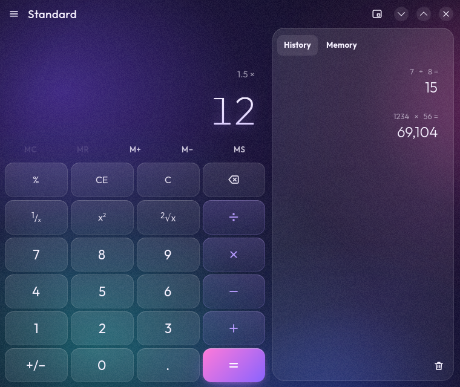
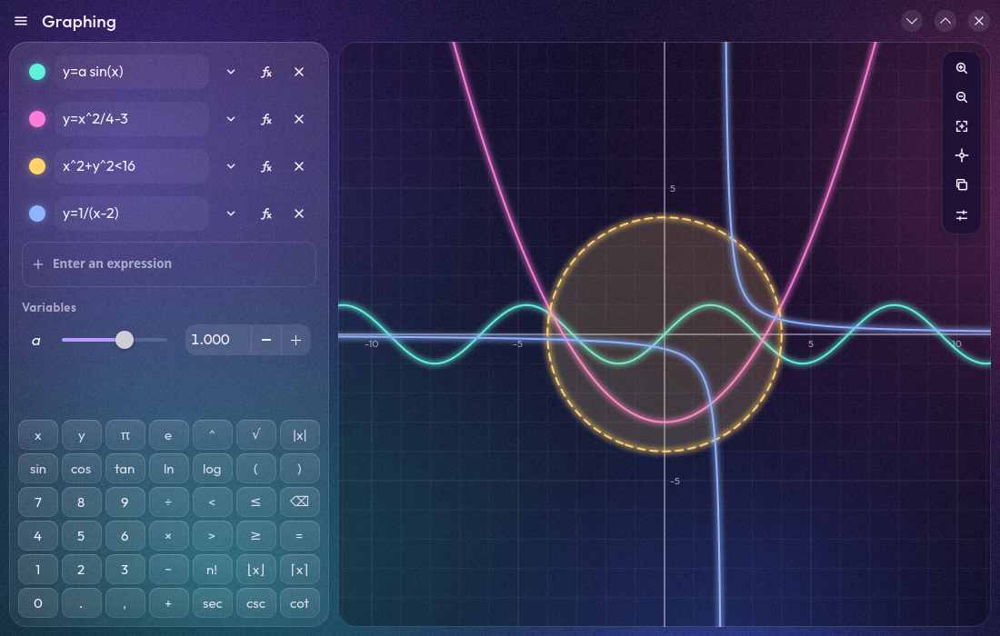
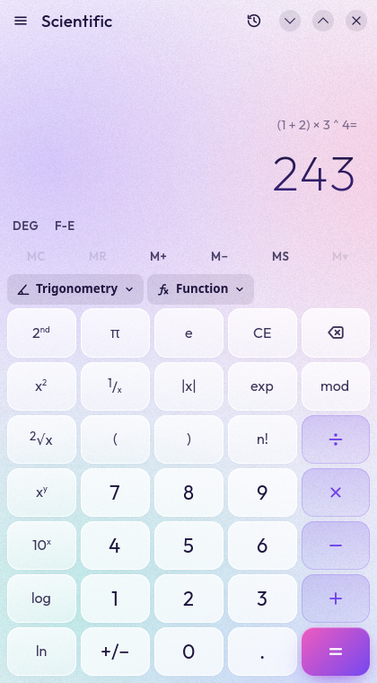
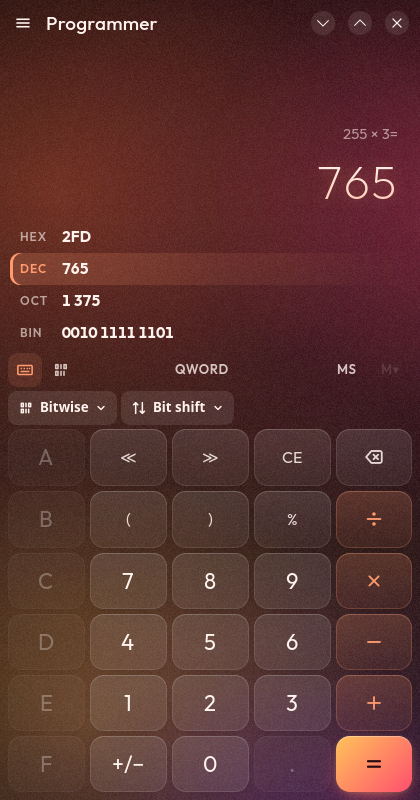
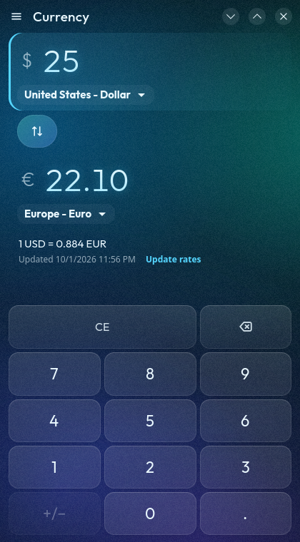
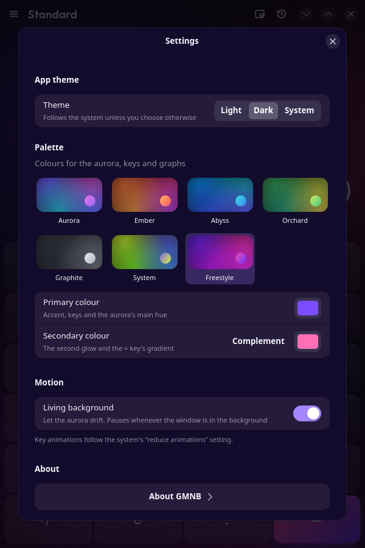
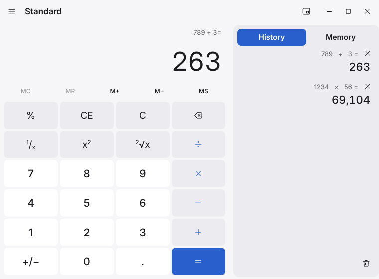

# GMNB & DGMNB

The open-source **Windows Calculator**, ported to Rust — twice.

- **GMNB — GlazeMyNumbers,Baby** looksmaxes: a GTK 4 / libadwaita interface
  that is considerably more beautiful than a calculator has any reason to be.
- **DGMNB — Don't Glaze My Numbers, Baby** resourcemaxes: the same calculator
  drawn in software with a plain interface, in about 13 MB of memory, doing
  nothing at all while it waits.

Both have every mode of the original: Standard, Scientific, Programmer,
Graphing, Date calculation, and thirteen converters (including live
currency), plus history, memory, keep-on-top, copy/paste and the full
keyboard map. The arithmetic is not a re-imagining: the original
arbitrary-precision engine (`Ratpack` + `CalcManager`) was ported
function-for-function and is checked against the real C++ engine.

> Not affiliated with or endorsed by Microsoft. Based on
> [microsoft/calculator](https://github.com/microsoft/calculator) (MIT).

## GMNB: pointlessly beautiful

<p align="center">
  
  
</p>
<p align="center">
  
  
  
  
</p>

## DGMNB: don't glaze my numbers

<p align="center">
  
  
</p>
<p align="center">
  
  
</p>

Light or dark (following your desktop), your desktop's accent colour if it
shares one (kept readable), no GPU, no animations, no idle CPU.

## Memory

| App (760×700 at 1× scale, idle) | RSS | PSS | Idle CPU |
| --- | --- | --- | --- |
| GMNB, default (Vulkan) | 267 MiB | 202 MiB | 0.3% |
| GMNB, software renderer (`GSK_RENDERER=cairo`) | 68 MiB | 40 MiB | 0% |
| **DGMNB** | **12.6 MiB** | **8.6 MiB** | **0%** |
| DGMNB, Graphing with three equations | 13.7 MiB | 9.5 MiB | 0% |
| DGMNB at 2× scale (the window buffer quadruples) | 21.1 MiB | 12.8 MiB | 0% |
| *KCalc 26.08.1, for reference (Qt 6)* | *79 MiB* | *36 MiB* | |

DGMNB's toolkit was picked by measuring a bare window with keys in each
candidate: winit + softbuffer + tiny-skia 9 MB, iced (tiny-skia) 14 MB,
Slint (software) 21 MB, GTK 4 without libadwaita 50 MB. Those prototypes
and the measurement scripts are in [`tools/bench`](tools/bench). DGMNB draws
straight into the compositor's shared-memory buffer and only redraws when
something changes. Its figure includes AccessKit's screen-reader bridge
(idle when no screen reader is running), the Wayland clipboard, and live
desktop colours.

GMNB renders on the GPU so the aurora, blur and glow stay cheap on the CPU;
nearly all of its extra memory is the GPU driver (here NVIDIA's Vulkan
stack) loaded into the process. To trade animation smoothness for memory,
turn off **Settings → Window → Vulkan acceleration** (it applies from the
next launch), or for one run:

```sh
GSK_RENDERER=cairo gmnb
```

An explicit `GSK_RENDERER` always wins over the setting. The same group's
**Background opacity** slider makes the backdrop see-through, so the desktop
shows through the window; whether it's blurred into frosted glass is up to
your compositor (most blur translucent windows only when told to, e.g. a
window rule for GMNB's app ID).

Measured with [`tools/bench/mem.sh`](tools/bench) on NixOS with an RTX 3070
(NVIDIA driver 595.104.02), in a headless Wayland session (weston) at
760×700, idle in Standard mode unless noted. RSS counts shared libraries in
full; PSS splits them between the processes using them. Numbers will differ
with other GPUs, drivers and fonts. The Vulkan row most of all: it is mostly
the driver's own memory, and it has measured anywhere from 205 to 267 MiB
RSS (121 to 202 MiB PSS) on this machine. It also takes a while to settle:
measured 6 seconds after start (`mem.sh`'s default), GMNB on Vulkan has
read 3–19% CPU and less memory while the GPU stack warms up; with
`SETTLE=30` it reads the 0.2–0.3% idle and the range above. The other
rows' RSS has held within a few percent; PSS moves more, since it depends
on which other processes share the same libraries at the time.

## Install

Every release attaches all of these to its
[GitHub release](https://github.com/Go08er/GlazeMyNumbersBaby/releases).

| Platform | GMNB | DGMNB |
| --- | --- | --- |
| **Flatpak** (any distro) | `flatpak install --user GMNB.flatpak` (GNOME 51 runtime) | `flatpak install --user DGMNB.flatpak` (freedesktop 26.08 runtime) |
| **Arch Linux** | `sudo pacman -U gmnb-*.pkg.tar.zst` | `sudo pacman -U dgmnb-*.pkg.tar.zst` |
| **Debian 13+ / Ubuntu 25.04+** | `sudo apt install ./gmnb_*_amd64.deb` | `sudo apt install ./dgmnb_*_amd64.deb` |
| **Fedora** | `sudo dnf install ./gmnb-*.rpm` | `sudo dnf install ./dgmnb-*.rpm` |
| **NixOS / Nix** | `nix run github:Go08er/GlazeMyNumbersBaby` | `nix run github:Go08er/GlazeMyNumbersBaby#dgmnb` |

The Arch `PKGBUILD` is a split package that builds both
(`makepkg -si` in `packaging/arch`).

**CPU:** on x86-64 PCs, GMNB's packages are built for x86-64-v3, so GMNB
needs a CPU with AVX2 (x86-64-v3): Intel Core from Haswell (2013) or AMD
from Excavator (2015) on, though not every Pentium, Celeron or Atom has
it. On any other it says so and stops, rather than crashing:
`gmnb` is a small launcher, built for any x86-64, that checks the CPU and
then runs the real program from `libexec/gmnb/` (`lib/gmnb/` on Arch).
DGMNB runs on any 64-bit PC. ARM builds of both have no such requirement.

### NixOS module

```nix
{
  inputs.nixpkgs.url = "github:NixOS/nixpkgs/nixos-unstable";
  inputs.gmnb.url = "github:Go08er/GlazeMyNumbersBaby";

  outputs = { nixpkgs, gmnb, ... }: {
    nixosConfigurations.myhost = nixpkgs.lib.nixosSystem {
      system = "x86_64-linux";
      modules = [
        ./configuration.nix # your existing configuration
        gmnb.nixosModules.default
        {
          programs.gmnb.enable = true;  # the glazed twin
          programs.dgmnb.enable = true; # the lean twin
        }
      ];
    };
  };
}
```

In an existing flake, add the input and the two module lines to your host.
There's also `gmnb.overlays.default` (adds `pkgs.gmnb` and `pkgs.dgmnb`) and
`gmnb.packages.<system>.{gmnb,dgmnb}` for Home Manager or
`environment.systemPackages`.

## Building from source

Everything goes through the flake; you don't need Rust installed.

| What | Command |
| --- | --- |
| Dev shell (cargo, rustc, clippy, rust-analyzer, GTK, Wayland) | `nix develop` |
| Run from source | `nix develop -c cargo run -p gmnb` / `-p dgmnb` |
| Native Nix packages | `nix build .#gmnb .#dgmnb`, or `nix run .#dgmnb` |
| **Flatpak bundles** | `nix run .#flatpak` → `dist/GMNB.flatpak`, `nix run .#flatpak-dgmnb` → `dist/DGMNB.flatpak` |
| Flatpak bundle + install | `nix run .#flatpak -- --install` (same for `flatpak-dgmnb`) |
| Refresh `cargo-sources.json` after changing dependencies | `nix run .#update-cargo-sources` |

Without Nix: Rust ≥ 1.92 and a C compiler for the vendored CORE-MATH (on
x86-64 one that knows `-march=x86-64-v3`: GCC ≥ 11 or Clang ≥ 12), then

- GMNB: GTK ≥ 4.18, libadwaita ≥ 1.7 and Pango ≥ 1.56, and
  `cargo build --release -p gmnb`;
- DGMNB: libwayland-client (and libxkbcommon at run time), and
  `cargo build --profile lean -p dgmnb`. The `lean` profile optimises for
  size, since DGMNB's own code is most of its memory, but keeps the number
  crunchers at full speed.

> Flakes only see files git knows about. After adding files, `git add -A`
> (staging is enough); the Flatpak scripts refuse to build if they find
> untracked files.

### Packaging layout

```
packaging/
  io.github.Go08er.GlazeMyNumbersBaby.{desktop,metainfo.xml}       GMNB
  io.github.Go08er.DontGlazeMyNumbersBaby.{desktop,metainfo.xml}   DGMNB
  icons/
  flatpak/   canonical manifests (Flathub-style: git tag + cargo-sources.json)
  arch/      split PKGBUILD (gmnb + dgmnb)
  debian/    copy to ./debian, then dpkg-buildpackage -b (needs rustup's cargo)
  fedora/    gmnb.spec (+ the dgmnb subpackage)
  licences/  generate.sh: regenerates THIRD-PARTY-LICENSES.txt from Cargo.lock
nix/         package.nix, dgmnb.nix, NixOS module, Flatpak tooling
```

Until it is tagged, a release is marked unreleased: `type="development"`
in the metainfo files, `UNRELEASED` in `debian/changelog`. Tagging means
dating it there and in the Fedora `%changelog`; the `Packages` workflow
refuses a tag that's still marked.

`nix run .#flatpak` reuses the canonical Flatpak manifest verbatim, only
swapping its source for an offline tarball with every crate vendored by Nix.
The `Packages` workflow builds the Flatpak, Arch, Debian and Fedora packages
in their real distro containers and attaches them to the release.

## Layout

```
crates/ratpack      Ratpack + Number/Rational/RationalMath (arbitrary precision)
crates/calcmanager  CEngine + CalculatorManager + history + expression commands
crates/calcvm       StandardCalculatorViewModel & friends (UI-agnostic)
crates/unitconv     UnitConverter engine, unit tables, currency, view model
crates/datecalc     DateCalculator + its view model
crates/copypaste    CopyPasteManager (paste validation → key sequences)
crates/graphing     Graphing engine (parser, sampler, certified analysis)
crates/crmath       CORE-MATH's correctly rounded functions (vendored C),
                    built for x86-64 and x86-64-v3, picked at run time
crates/appcore      Everything the twins share that isn't drawing: modes, key
                    layouts and the keyboard map, settings, colour maths,
                    graph sessions, a tiny D-Bus client, time zone fix
crates/x11paste     X11 clipboard and drop reads with a byte cap (both apps)
apps/gmnb           The GTK 4 / libadwaita application
apps/gmnb-launcher  Installed as `gmnb`: checks the CPU, then runs GMNB
apps/dgmnb          The software-drawn application (winit, softbuffer,
                    tiny-skia, swash, AccessKit)
tools/oracle/       C++ drivers that generate the golden test data
tools/fonts/        How DGMNB's embedded font subsets are made
```

## Verification

`nix develop -c cargo test --workspace` runs **958 tests** (counts include
doctests; three more, a live currency fetch, the full metamorphic graph
sweep and 20,000 random saved sessions, are `#[ignore]`d).
`cargo run --release -p graphing --example sweep`
checks graph analysis against about 3,400 generated functions (shifted,
offset, scaled and stretched variants, close and far centres, jumps,
incommensurate sums, values beyond a double's range) for claims the
function's own values contradict, and exits with an error if it finds one;
`--legacy` checks the earlier sampling engine behind its own check, and
`--ungated` that engine alone.
`cargo run --release -p graphing --example oracle` is a second, deliberately
independent check of the same answers (it shares none of the app's checking
code, only its formatter and reference evaluator). The D-Bus and
X11 tests start their own `dbus-daemon` and `Xvfb` from the dev shell (and
skip without them). DGMNB's Wayland clipboard test copies text, so it only
runs against a compositor named in `DGMNB_TEST_WAYLAND_DISPLAY` (a headless
weston's socket, say), never your session's. The heart of it
is differential testing against the *real* C++ engine, compiled from the
upstream sources with g++:

| Crate | What's checked |
| --- | --- |
| ratpack (12) | 13,628 golden cases from the C++ Ratpack (every op and function, all angle types, radixes 2, 3, 8, 10, 16 and 36, formats, precisions, error codes), byte-for-byte; port of `RationalTest.cpp` |
| calcmanager (79) | 3,500 golden command sequences replayed against the C++ `CalculatorManager` (every display callback, expression token, history and memory state); ports of `CalcEngineTests`, `CalcInputTest`, `CalculatorManagerTest` |
| calcvm (168 + 1 ignored) | Ports of `StandardCalculatorViewModelTests`, `HistoryTests`, the snapshot tests, plus programmer/paste/event coverage and the saved-state size budget (long pasted sessions keep their newest History, memory and modes) |
| unitconv (140 + 1 ignored) | Ports of `UnitConverterTest.cpp`, `UnitConverterViewModelTests`, currency tests, a known value for every unit, network-policy cases |
| datecalc (40), copypaste (40) | Ports of `DateCalculatorTests` and `CopyPasteManagerTests`, plus paste key-sequence tests |
| graphing (352 + 1 ignored) | Parser, certified explicit plots (no join across a pole, jump, domain edge or hole; nothing visible left out; chords within tolerance; holes marked and unjoined, and no false ones, at hundreds of canvas sizes; steep lines up to 10³⁰⁰·x) and holes, tracing values and steep-curve stepping, implicit/inequality plots, function analysis (the certified panel: no row certified wrong on the certify corpus truth table, exact forms only where proven, partial lists and unknown rows; poles, zeros and domains far out, tiny bounds, points where an intermediate is undefined, values beyond a double's range), frame-time budgets, prompt cancellation of running plots and analyses (the heaviest known analyses bounded and cancellable), and regressions for hostile input (deep nesting, huge nCr/nPr, extreme ranges, runaway analysis, dense pole families) |
| appcore (55) | Keyboard map, key scripts, converter paste validation, settings storage (huge/corrupt files, per-section budgets, a long calculator session that used to cost the whole file), colour contrast, saved-equation sanitising, D-Bus wire format (both byte orders), hostile and fuzzed messages, portal signals from impostors and the OpenURI request flow against a stand-in portal on a private bus |
| crmath (1) | The vendored CORE-MATH's two builds (baseline and x86-64-v3) give the same bits |
| x11paste (5) | Against a private Xvfb: a read cut at its byte cap fetches no further and keeps whole characters, PRIMARY and drag selections, and the rest of a cut transfer goes by so the owner can serve again |
| gmnb (20), gmnb-launcher (4), dgmnb (63) | GDK key translation, palette contrast for extreme accents, settings compatibility, licence text that parses as markup; the launcher's CPU check on injected CPU flags (Haswell passes; Nehalem, Sandy Bridge and a Gemini Lake Celeron don't; each x86-64-v3 feature alone stops it) and where it finds GMNB; DGMNB licence wrapping, text shaping and font coverage, SVG icons, text editing, accessibility tree soundness, hole markers, keyboard tracing up steep lines, scrolled-out controls, keyboard-scrollable panels, the display's spoken value, touch pinch, clipboard teardown, pipe deadlines, and X11 paste (formats, size caps, deadlines under event floods) against a private Xvfb |

The oracles live in `tools/oracle/` and need the upstream repository checked
out at `reference/calculator` to regenerate the golden files.

CI also runs checks that need more than `cargo test --workspace`:

- **Certificate replay** (`cargo test -p graphing --features mpfr-oracle
  --test certify_replay`): the certified analysis of each of the certify
  corpus's 204 functions goes through JSON to a separate checker
  (`crates/graphing/tests/replay`) with its own MPFR interval arithmetic,
  sharing only graphing's parser and expression tree with the certifier. A
  claim is *strong* when it re-proves it on the function's own tree, *weak*
  when it can only prove it on a tree the certifier supplied (the
  simplifier's form, the derivatives) or check it at sample points, so it
  rests on the simplifier: today 74,363 strong, 195 weak. A claim refuted
  or left open, or a row that doesn't follow from its claims, fails it.
- **MPFR oracles** (same feature): `interval_oracle` checks every interval
  operation's enclosure against MPFR at 256 bits on adversarial boxes,
  `simplify_rules` checks every simplifier rule on both sides wherever its
  left side is defined.
- **`bits`** (`cargo run --release -p graphing --example bits`): every
  built-in function's results, bit for bit, from a plain x86-64 build (which
  runs both CORE-MATH builds), an x86-64-v3 build and the plain build on an
  emulated Nehalem; any difference fails.
- **`identities`** (`--example identities`): two spellings of one function
  at extreme arguments (subnormals to 10³⁰⁰, both sides of ±1, the edge of
  eˣ) must read the same in the panel's formatting.
- The launcher on an emulated Nehalem must refuse with its message, and the
  D-Bus, X11 and Wayland tests must run rather than skip.

## Deliberate differences from the original

- **Currency rates come from a public source.** Windows Calculator gets its
  rates from Bing, and Microsoft doesn't license that data for other use, so
  its open repository can only show static mock rates (fictional planet
  currencies). Both twins fetch central-bank reference rates (158
  currencies) from the keyless [Frankfurter](https://frankfurter.dev) API,
  cache them, and fall back to a bundled snapshot when offline.
- **Graphing uses a new numeric engine.** The original graphing engine is
  proprietary (open-source builds contain only a mock). This engine was
  written against the original's interfaces and reproduces its features:
  explicit, implicit and inequality plots, variables with sliders,
  tracing, and key-graph-feature analysis. The analysis panel shows only
  what is proven: every row comes from a certified analysis (interval
  arithmetic with directed rounding and an exact simplifier) that either
  proves the answer complete, proves the items it lists but not that they
  are all (the row then says where it is complete, or that there may be
  more), or says it can't tell ("Unable to calculate …"; "… is unknown"
  for parity, periodicity and monotonicity) rather than "none". Numbers
  are exact (`√2`, `π/2 + kπ`, `−9/4`) only when exact arithmetic confirms
  them; otherwise they get as many significant digits as the proof fixes,
  from three to six (written m×10ⁿ from 10⁶), marked "≈" because they
  aren't exact; two different numbers of a row that would read alike get
  up to fifteen, to tell them apart, and a value the proof fixes to fewer
  than three digits leaves its row unknown. A number typed in an equation,
  and a slider's value, is a decimal (`0.1` is one tenth, not the double
  nearest it), rounded to **Settings → Number precision**: 14 significant
  digits by default, as the TI-84 Plus CE keeps them, from 5 to 20, or Off
  for the decimal exactly as typed. Arithmetic on those numbers alone is
  done exactly (or, if an exact value would outgrow 2¹⁴ bits, left unknown
  rather than rounded), so `10^17·(0.1 + 0.2 − 0.3) + x` is the line y =
  x, and the curve drawn, its trace and its analysis all read the same
  function. This is more conservative than Windows' symbolic engine:
  functions it can't prove (some poles and far features) get fewer
  answers. Windows-parity of the analysis is not claimed; the conventions
  it follows where Windows' choice isn't known are in
  [docs/ti-conventions.md](docs/ti-conventions.md).
- **Explicit curves: joins are proven until a work budget runs out.**
  Within the budget, two plotted points of y = f(x) are joined only when
  interval arithmetic proves f defined and continuous between them and the
  line between them within about a pixel of the curve; elsewhere the
  sampler subdivides, and leaves a gap where it can't prove that down to a
  hundred-thousandth of a pixel: at poles (`tan x`, `1/x`), jumps (`floor
  x`) and domain edges (`√x`). Spikes and oscillations narrower than a
  pixel (`sin(1/x)` near 0) are drawn through their true extremes. A
  removable hole (`(x²−1)/(x−1)` at 1, `x/x` at 0) is drawn as an open
  circle, where Windows and the TI-84 show nothing. A hole at a point that
  isn't a double (`tan x·cos x` at π/2) can't be proven undefined at any
  double, so it isn't marked: its gap is far narrower than a pixel. A
  circle needs f proven undefined at a number in a gap far narrower than a
  pixel, proven defined on both sides, and its enclosures on the two sides
  closing in on one value as they near the gap. That is a check, not a
  proof that the two limits are equal: a jump smaller than the enclosures
  can resolve may still get a circle (a pole of `x!` never does). No
  sampled point is drawn or traced more than a quarter pixel outside f's
  enclosure at its x: where the evaluated value falls outside a wider
  enclosure, the curve breaks there. Not checked this way: dense-pole
  columns and what's drawn past the budget (both flagged as missing data),
  the points where a stroke is cut at the edge of the drawing area (on the
  chord between two checked points), and a hole's circle, which marks a
  point where f is undefined. A pixel column with more poles than a pixel
  shows (`tan 100x` at ±1000) is drawn as a stroke down the column, joined
  to neither side. Each curve has a fixed work budget, counted rather than
  timed (the same view draws the same on any machine), spent on the breaks
  first and the shapes second. Where it runs out (very long or wildly
  oscillating functions), the rest is drawn coarser: continuous parts are
  still joined only where proven, undecided ones only where sampling finds
  no jump, but chords there may stray from the curve by more than a pixel.
  The plot is then flagged as having missing data (the apps don't show
  that yet); so it is where the shape of a piece under a pixel wide can't
  be bounded, as in the pixel beside a removable hole (`x/x` next to its
  circle: the enclosure of x/x there doesn't know the two x are one),
  which is joined as proven continuous through point samples. The boundary
  of an explicit inequality (`y < tan x`) is drawn the same way, but
  implicit plots and inequality regions are unchanged in 0.2: still
  sampled in floating point (a certified plotter for them is planned for
  0.3).
- **Tracing shows only what is determined.** On y = f(x) the traced x is
  the decimal shown, and y comes from f's interval enclosure there, to the
  digits it fixes: the view's precision, as in Windows; up to three more
  for a value on a rounding boundary; fewer if the enclosure is wider, down to
  three significant digits. It is marked "≈" unless exact (read
  "approximately" by screen readers; exact also where f is a rational
  function of x whose value at the decimal is a double: `x/x − 1` at 0.26
  is 0), and reads
  "undefined" where f is proven undefined (at a hole's circle; a pole or
  domain edge is passed over) or "unknown" where the enclosure can't tell.
  On steep curves x is rounded finer, from f′, so tracing still moves
  pixel by pixel. Points traced on implicit curves and inequality
  boundaries are floating-point approximations, marked "≈".
- **Keep on top** switches to the original's compact overlay, but Wayland
  has no client-side "always on top": pin it with your compositor (e.g. a
  niri window rule for the app ID).
- Dates use the Gregorian calendar; strings are en-US.
- **A restored session continues where it left off.** The original's
  saved session shows the operand before a recalled value instead of the
  value, "0" instead of a result stored with MS, and reopens a finished
  calculation, so the next = evaluates it again rather than repeating its
  last step. The twins also save what the display, the expression line and
  the engine hold apart from the keys typed (a shown or History-selected
  value, what = repeats, how the number being typed stands, a paste error
  over a calculation, the operand % takes after =, the carry of a rotation
  through carry, whether the C key is CE), so after a restart the keys
  carry on the same calculation. Its numbers come back as they were shown,
  though: a result, an operand of the expression and a memory slot return
  with the digits the display gave them (in Programmer mode a memory slot
  as the word size shows it), so a later answer that depends on the digits
  beyond those can change. After 9999999999999999 + 2 = (shown as
  1.e+16) and −, subtracting 9999999999999999 gives 2, or 1 after a
  restart; after 1 ÷ 3 = and −, subtracting 0.3333333333333333 gives
  about 3.3×10⁻¹⁷, or 0. On restore the session is saved again and
  compared with what was loaded; a state that doesn't come back the same,
  or that the saved keys can't rebuild, comes back as a new calculation
  from the value shown: the next digit replaces it, = repeats nothing, and
  memory, History and the modes are kept. That check compares what is
  saved; the randomized restore tests also compare the engine's own state.
  A saved session takes at most 3 MiB, so the settings file always loads:
  an ordinary History fits whole, but each item keeps every key of its
  calculation (40 pastes of a 100-term sum make one of 0.72 MB), so past
  that the oldest items go first, from whichever mode's History is larger;
  a calculation too long to replay (over 16,384 keys) is saved as its
  value. Memory, the modes, the equations and the other settings are never
  dropped for it, and a damaged or oversized part of the settings file
  resets only itself. Memory comes back slot for slot (to the digits shown,
  up to e±19999, beyond what keys can reach), within the restore's
  arithmetic budget: only a crafted file, such as 100 slots all past
  e±9999, comes back with fewer.
- The port fixes a handful of upstream bugs and undefined behaviour (e.g.
  deleting a history item removed the wrong entry; C left the engine in
  E-notation); each is commented at the fix.

## Notes

- **Flatpak on NixOS:** Flatpak can't translate NixOS's `/etc/localtime`
  and runs sandboxes in UTC. Both twins ask systemd-timedated for the real
  zone (read-only `org.freedesktop.timedate1` access), so "Updated …" times
  and Date's "today" are local.
- GMNB is a single-instance app; DGMNB isn't. Two DGMNB windows each keep
  their own history and settings, and the last one closed saves them.
- DGMNB's clipboard works on Wayland and X11; copied graphs are offered as
  `image/png`. On X11 it pastes `UTF8_STRING`, `text/plain;charset=utf-8`,
  `text/plain`, `TEXT` or Latin-1 `STRING`, whichever the owner offers first
  in that order.
  Pastes over 1 MiB are refused on both.
- NVIDIA's driver busy-waits on GPU fences by default, which costs ~20% of a
  core even for gentle animation; GMNB sets `__GL_YIELD=USLEEP` for its own
  process unless you've set it yourself. DGMNB doesn't touch the GPU.

## Licences

The code is MIT; see [LICENSE](LICENSE), which carries Microsoft's original
notice. GMNB embeds the *Outfit* typeface (`apps/gmnb/assets/fonts/`), DGMNB
subsets of *Inter* and *Noto Sans* (`apps/dgmnb/assets/fonts/`), all under
the SIL Open Font License. Exchange-rate data comes from Frankfurter
(central bank reference rates).

Both also contain code by others:
[CORE-MATH](https://core-math.gitlabpages.inria.fr/)'s correctly rounded
functions (MIT; their authors are listed in
[`crates/crmath/vendor/COPYRIGHT`](crates/crmath/vendor/COPYRIGHT)), DGMNB's
Wayland clipboard code adapted from smithay-clipboard (MIT), and the Rust
crates they are built from (MIT, Apache 2.0, BSD, ISC and others).
[THIRD-PARTY-LICENSES.txt](THIRD-PARTY-LICENSES.txt) has every one of those
notices; it is installed with each package, and both apps show it (GMNB:
About → Legal; DGMNB: Licences).
